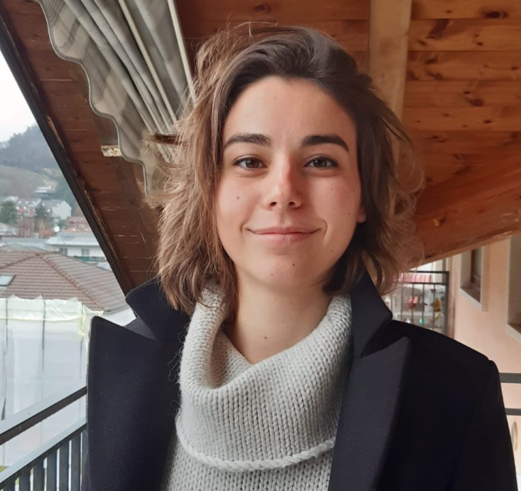

# Introduction to Computational Methods for the Brain Sciences

  Department of Brain Sciences  
  Imperial College London  

**Contributors:**
 

| [Dragos Gruia](https://www.imperial.ac.uk/people/dragos-cristian.gruia19)  	| [Valentina Giunchiglia](https://www.imperial.ac.uk/people/v.giunchiglia20)   |
|---	|---	|

 

**Lead TAs contacts:**
 
 
Dragos Gruia: <a href = "mailto: dragos-cristian.gruia19@imperial.ac.uk ">dragos-cristian.gruia19@imperial.ac.uk </a>
 
Valentina Giunchiglia: <a href = "mailto: v.giunchiglia20@imperial.ac.uk">v.giunchiglia20@imperial.ac.uk</a>

## Introduction

**Module 3 from the MSc in Translational Neuroscience** will introduce you to the most relevant computational methods for the Brain Sciences. It will be divided into 8 days, where each day handles a different thematic and methodology. Each day will consist of workshops and lectures, that start in the morning and end at 5pm. 
      
      Apart from day 1, all the other days will be characterised by a final CHALLENGE. 
      At the end of the first week, you will be randomly assigned one of these challenges, 
      which you have to complete and present in a report, that will be assessed. 
      In the afternoon of each day, you will have the opportunity to start working on 
      the challenge of the day, and ask questions to the TAs in case you have any doubts or problems. 

The general format of each day will be the following: 

1. **Morning**:
    * Introductory lecture 
    * Guided workshop
2. **Afternoon**:
    * Start of potentially assessed challenge (with help of TAs)

**The data for all workshops can be downloaded [here](https://imperiallondon-my.sharepoint.com/:f:/g/personal/vg816_ic_ac_uk/EhHQbb-ruvFNqZm1a_5XmY8BfzRxYfLnHRGCFW5wq222Kg).**

## Lab experiments

To run the lab experiments, you can use Anaconda, [Visual Studio Code](https://code.visualstudio.com/docs/datascience/jupyter-notebooks), or Google CoLab. 
For more information on how to use Google Colab with GitHub, see this [link](https://colab.research.google.com/github/googlecolab/colabtools/blob/master/notebooks/colab-github-demo.ipynb#scrollTo=-pVhOfzLx9us).   We suggest you to use Jupyter Notebook, and move to Google Colab only if there are significant issues (that cannot be addressed easily) while using Jupyter. For more information on how to use Google Colab with GitHub, see this link.

## Schedule

The schedule of the Module is presented in the following table.

| Date | Topic | Morning Schedule | Afternoon Schedule| Link to Lecture |
| :---: | :---: |:--- |:--- |:---|
| 9th November | Introduction to Programming | <ul><li>*OPTION 1*: Review of primer exercises + Q&A on lectures and exercises </li><li>*OPTION 2*: Advanced visualization using Seaborn or cognitive data anlysis exercise</li></ul> | Coding Exercises |  [Introduction to Python](./01-%20Introduction%20to%20Python/) &nbsp;&nbsp;   Seaborn:  &nbsp;   Coding Exercises: ) &nbsp;| 
| 10th November | Big data analysis: COVID and Cognition| <ul><li>*LECTURE:* Data cleaning and processing</li><li>*GUIDED WORKSHOP*: big data analysis of COVID and Cognition</li></ul> |  <ul><li>*CHALLENGE*: big data analysis of Dementia and Cognition </li><li> *LECTURE:* How to write a report?</li></ul> | [Covid and Cognition](./Day2/) &nbsp;&nbsp;   ) &nbsp;  | 
| 13th November |  Cognition and self harm  | <ul><li>*LECTURE:* Cognitive differences in self harm </li><li>Lived experience interview </li><li>*GUIDED WORKSHOP*: cognition and self harm</li></ul> | *CHALLENGE*: Cognition and eating disorders |  [Cognition and self-harm](./Day3/) &nbsp;&nbsp;   ) &nbsp;  | 
| 14th November |  Introduction to fMRI and sMRI analysis | *GUIDED WORKSHOP*: analysis of Parkinson's fMRI data | *CHALLENGE*: analysis of OCD fMRI data| 
| 15th November |  fMRI Graph theory and connectivity | *GUIDED WORKSHOP*: introduction to fMRI graph analysis | *CHALLENGE*: brain connectivity changes in the psychedelic state| 
| 21st November |  Introduction to Machine learning | <ul><li>*LECTURE:* Machine learning </li><li>*GUIDED WORKSHOP*: Alzheimer's prediction using machine learning </li></ul> | *CHALLENGE*: prediction of Alzheimer's progression| 
| 22nd November |  Substance use and substance addiction  | <ul><li>*LECTURE:* Substance use and substance addiction </li><li>*LECTURE*: NLP and topic modelling</li><li>*GUIDED WORKSHOP*: Analysis of drug use increase during the pandemic using NLP </li></ul> | *CHALLENGE*: Analysis of drug use decrease during the pandemic using NLP | 
| 23rd November |  Principles of Neuromodeling | <ul><li>*LECTURE:* Neuromodelling introduction </li><li>*GUIDED WORKSHOP*: Neuromodelling analysis </li></ul> | *CHALLENGE*: Neuromodelling analysis | 
